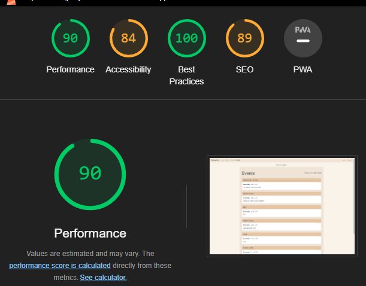
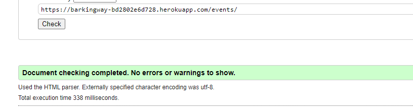
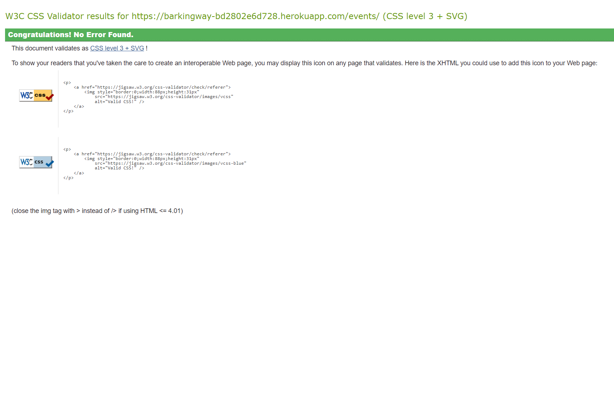
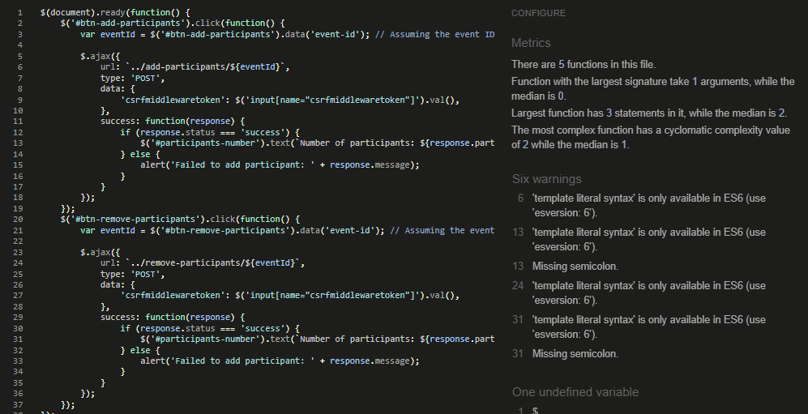

# F1 Dublin Race Ticket Booking System

## Introduction

Welcome to this amazing website dedicated to walks and events for dogs, which aims to create an environment where owners are not forced to join social groups to have an amazing way to let their dogs interact.

[Visit the Website Here](https://barkingway-bd2802e6d728.herokuapp.com/)

[Visit the Project's GitHub Repository Here](https://github.com/Max9414/BarkingWay)

## Website updated features

Implementing the research and filter has been easier than expected.\
Implementing a filter to show only the events of today and future has been harder. The main issue has been understanding the logic. I've already worked with logic through models and views,
but my habit still goes to the html page rather than to the db itself. After failing many times trying to implement logic in the html and realising I could just implement the same logic in the db itself, the solution has been pretty fast to find.\
The last implementantion, the checker to see if someone joined already the event or not, is being really problematic. I've added correctly the logic to save user and event, the db updates correctly, but I can't seem to do the last part of logic to show the currect button. Even though when troubleshooting I receive the correct user and event value, I can't seem to make the logic work.

## STRATEGY

Thinking about this project's features have been kinda hard. As the target audience has a big range of age, deciding what to do hasn't been easy. Most feature, though, have been mostly thought for people between 18 and 45 yo
which are used to technology.

The target audience consists of:

18 - 45+ year olds.
People that are dog owners or dog lovers.
People who enjoy spending time outside and go for walks

As a result, users will expect:

A website with easy navigation and a logical progression to its flow.
Plenty of information with regards to the website features.
The ability to find informations, join events and create/manage the events created.

## PURPOSE

The purpose of this website is to connect people, still keeping a good level of privacy. The website is indeed thought as a middleware for people who enjoy walking and meeting new dog owners, without the need to share personal
informations, like mobile phone numbers, social medias or any other type of contact. This website allows everyone to enjoy company on a low effort.

[Project's user stories](https://github.com/users/Max9414/projects/5/views/1)

## SCOPE

In order to manage all the user stories (I set priorities on my tablet to have a clear structure on how to proceed), this have been my focus during the project:

### Authentication and user:

As my project heavily relied on the user, to create a dynamic profile page where everyone could check their info, dogs and events created + manage them,
setting the authentication and the models related to the user were extremely important.

### CRUD and dynamic pages:

As I was planning (and managed to) have 2 dynamic pages with CRUD functionalities, focusing on one of the two have massively reduced the amount of work and new code necessary for the other.
While they both had their unique parts, the basic functions were the same.

### Home, static pages and styling:

The last step of my project has been creating the homepage, breeds page and pet-care page and writing the lengthy texts about them, plus styling the whole project. Even though it's not
really appreciated by lighthouse, I find the colours chosen to be warm and in theme with a dog website. Also, I actually find the contrast to be pretty solid.

### Optional features:

I left the optional features out, the only one I thought about at the project start was the research field, but also the later on thought implementation of a checker to join/leave events
for possible future updates after the end of the course. I've researched the logic to implement them, but given the time left, I decided to leave them out as they're not necessary.\
Another feature to add is the automatic deletion of the events that have already taken place. For now, it's the job of the admin.

## STRUCTURE

The structure has been created before starting the project, on my pad as it seemed to be the easiest way to visualise my concepts.\
I started from the user, main character of this project and its features and built around it all the necessary models.\
Following the user stories I created before starting the project, I implemented the user as foreignkey in every db that needed interaction with it.\
After making sure the user was implemented correctly in all the db, I started building the single databases.\
Again, following the scope, I started from the dynamic pages, d_o_profile (dog_owner_profile) and events, creating all the necessary fields and controls.\
After finishing to build the project, I see that I could have planned ahead a bit better, for example adding another voice in the events model to capture directly in the db
the list of users joining the walk, which would have saved me from the need of implementing it later in time. I decided to not reset the database to fix this mistake, as I
think it will bring much more knowledge if I solve this problem indirectly. Also, I'll be much more careful in the future.

### Project applications

For this project 5 applications were created:

- breeds: static page about breeds
- petcare: static page about tips and tricks
- homepage: static page explaining every other page
- events: dynamic page where people can create, manage and join events
- d_o_profile: dog_owner_profile, where the owner can add all their dogs and see all the events created

## SKELETON

To make this project idea's more clear, I used lucidchart. In the program, I was able to write down all the initial ideas and discard the ones that were actually way over my abilities.\
It's been a great tool to have a reality check of my knowledge/capacity and to realise the amount of time necessary to actually build the website.\
The idea has been developed further while creating user stories, which helped me greatly understand more where to focus my attention.\
[Lucidchart project idea](https://lucid.app/lucidchart/2d8353b0-c243-483f-ab25-b5180b122074/edit?invitationId=inv_9e852b16-7658-4e68-b8ec-12ed31a309e7&page=0_0#)
p.s. I'm not 100% sure this link will work.

## SURFACE

Choosing the colours and overall styling have been quite straight forward:\
Websites choosing only white should be banned in my opinion, they're too bright and they don't help when people have to stay in front of the screen
for many hours either for work or for any other reasons.\
For this reason, I knew I didn't want a white page for sure. As the project is about dogs, though, I couldn't also choose dark colours as I would
have liked to, because it's not really in line with the idea of the project.\
I think the warm brown colour chosen and the easy but clear styling are perfect for the website.\
Also, making everything a bit smaller and more divided into different rows in smaller screens should help with clarity and readability.

## Pages

### Breeds and Pet-care

These 2 pages don't really require big explanations.\
The pages are static, only the admin can add stuff. They show articles about breeds or pet care in a list, paginated by 6 and
it allows the user to click on any to see more details

### Homepage

The homepage has links in the description for the other pages and just presents infos for all the pages and the website in general.

### Events

The event page is a dynamic page and it offer many features:

- create event: the page allows you to create an event, as long as you're logged in
- delete/modify event: if you're the event creator, you'll be able to modify or delete the event
- event list: the page shows all the possible events plus gives you the chance to create an event if you're logged in or asks you to login to do so
- participate event: it's just a view connected to a js that allows user to join or leave an event without needing to load the same or another page

### D_o_profile

The Dog/Owner profile has both the profiles for owners and dogs.\
Only logged in users have the chance to add their dogs to the database or modify or remove them.\

- create/delete/modify profiles: these features are available for both human and dog profiles. p.s. the human profile cannot be deleted as of now.
- humanprofile: it shows the owner info, which are minimal as not really important, all the owned dogs and all the created events and modify/delete them.

# Tests

\
The main issue with lighthouse accessibility is for colour contrast, that I actually decided to not change as it suit the website vibe and links being not underlined
or more expressed. That's a choice, as I find the website much cleaner like this. I added only a couple of underlined elements, one time directly in an inline styling
Every single page has been tested through validator.W3 and didn't present any errors.\
\
Every single page has been tested through jigsaw.w3 and passed all the tests.\
\
A couple of missing semicolons have been found, but nothing concerning for logic or syntax.\
\

The PEP8 testing showed a lot of indentation problems as I've gone a little longer than 79 characters in different occasions.\
As the time is not much and I'm not confortable changing everything and risking to do something wrong with the code, I hope these small mistakes won't impact greatly the final note.

# Main problems

Most of the problems I encountered were related to indentations and logic.\
While the other exams were really straightforward, a lot of django knowledge and relations with db is really hard to understand.\
The very core of django, views and forms, have been really hard for me to understand.\
The course have been really informative, but learning django and understanding its features is no joke, you need to think ahead for a lot of things that,
in the past, you could just solve later. The fact that databases are involved in the structure, makes everything less straightforward.\
Also, it's true that Apps make everything really organised, but handling for the first time a project by myself of this dimension have been much more challenging
than I thought. The amount of knowledge, both raw and of logic, needed is really massive and it challenged me much more than in previous exams.\
I've struggled with deployment to heroku, as the passages are little tricky. Trying to fix the problem just through error messages and knowledge memory has been
challenging, but definitely useful for future projects.

### Credits

I've followed a video to understand how to create automatically the owner from a registration, but I actually decided to only use a little snippet of the whole video
and do authentications, login, logout and registration following the course.\
@receiver(post_save, sender=User)
def user_postsave(sender, instance, created, \*\*kwargs):
user = instance

    # Add owner profile if user is created
    if created:
        owner = Owner.objects.create(name=user)\

This is the snippet taken from the video\
[video](https://www.youtube.com/watch?v=SQ4A7Q6_md8&t=1587s)
