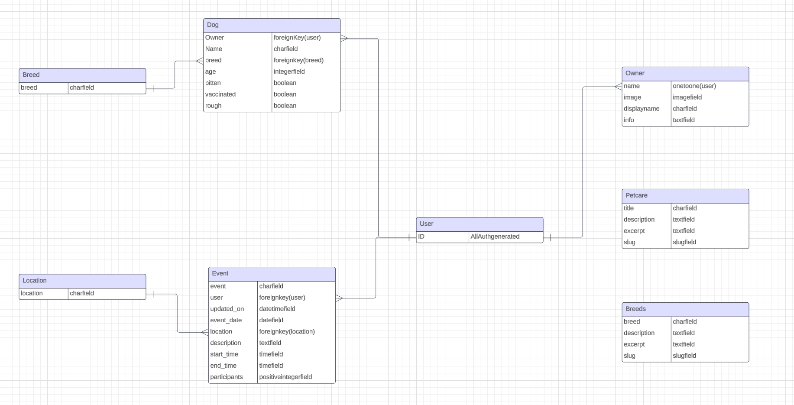

# BaringWay

[Visit the Website Here](https://barkingway-bd2802e6d728.herokuapp.com/)

[Visit the Project's GitHub Repository Here](https://github.com/Max9414/BarkingWay)


## Introduction

Welcome to Barkingway, a FullStack website dedicated to events for dogs. The website presents pages dedicated to knowledge about breeds and pet-care and the main page, an event page where people can create and manage their events.
The purpose of this project was a build a full-stack site based around a business logic used to control a centrally-owned dataset. The technologies used for this project are HTML, CSS, JavaScript, Python, and Django.
The Database used was provided by code institute with PostgreSQL.

## UXD - User Experience Design

The user has been the cardinal point of my project, trying to take decisions that would facilitate both the readability and the positive experience of the user.

The planning of the project is broken into 5 planes:

- The Strategy Plane
- The Scope Plane
- The Structure Plane
- The Skeleton Plane
- The Surface Plane

---

## The Strategy Plane

### User stories

#### Homepage User stories

- As a visitor, I want to see a brief description of each page on the homepage so that I know where to find the information I need.
- As a visitor, I want to view the homepage so that I can learn about the site's purpose and the different pages available.

#### Pet-care page User stories

- As a visitor, I want to see detailed pet care tips so that I can follow expert advice for keeping my pets healthy.
- As a visitor, I want to view a list of pet care suggestions so that I can better care for my pets.

#### Breeds page User stories

- As a visitor, I want to click on a specific breed to see detailed information about it so that I can understand its characteristics and care needs.
- As a visitor, I want to view a list of different dog breeds so that I can learn about their key features.
- As a visitor, I want to be able to search dog breeds for keywords, so I can find breeds that suit my taste. (Used to create other search bars as well)

#### Registered user User stories

- As a registered user, I want to view my user profile page so that I can see my personal information and activities.
- As a registered user, I want to edit my profile information so that I can keep my details up to date.
- As a registered user, I want to add and view profiles of my owned dogs so that I can keep track of their information and share it with others.
- As a registered user, I want to upload pictures of my dogs to their profiles and modify their profiles, so that I can showcase them to the community.
- As a registered user, I want to delete a dog's profile in case of death for example.
- As a registered user, I want to view a list of upcoming dog-related events so that I can participate in activities and meet other dog owners.
- As a registered user, I want to log in so that I can access my personal dashboard and other member-only features.
- As a registered user, I want to log out so that I can secure my account when I'm done using the site.

#### General non User User stories

- As a visitor, I want to view a list of upcoming dog-related events so that I can decide to join the website if I'm interested.
- As a visitor, I want to register for an account so that I can access member-only features.

#### Superuser user stories

- As a superuser, I want to be able to manage the contents so that I can filter bad events or delete spam profiles.

#### Events page User stories

- As a registered user, I want to be able to join an event so that I can show my presence to the event creator and everyone who checks the event.
- As a registered user, I want to create an event for dog-related activities so that I can organize and invite others to participate.
- As a visitor, I want to view a list of upcoming dog-related events so that I can decide to join the website if I'm interested.
- As a registered user, I want to view a list of upcoming dog-related events so that I can participate in activities and meet other dog owners.

---

## The Scope Plane

The features designed for the project would have required a lengthy amount of time and a vast research of knowledge.\
Therefore I decided to take a phased deployment:

**Phase 1**

- Satisfy the must have user stories.
  - Homepage with clear pages description
  - Functional event page with CRUD functionalities
  - Pet-care and breeds page with article and pagination
  - Functional user page with CRUD functionalities

**Phase 2**

- Additional features
  - Research and filters bar
  - Filter to show only future events
  - Events created in the user page
  - Join/leave event checker

**Phase 3**

- Advanced features and feedbacks
  - api to create events directly on map
  - interaction with the dog profiles and more customizable events
  - users feedback for implementations

---

## The Structure Plane

#### Colors


I used warm colours for the body, containers and cards and contrasting them with dark cold colours for the text, creating a warm and contrasted easy to the eyes website.

#### Fonts

For the fonts I used Roboto, an easy and clear style. I opted for a single font to keep the design the same throughout the different pages.

#### Database design



#### Key Models

**Owner**

- The owner profile has been linked to several other models to give the user as much clarity on their activities as possible
- The name field, the only necessary for the user page to work, is autogenerated when the User model is created through AllAuth.
- Its main relations are with Dog and Events

**Dog**

- The dog profile can be created through the user page.
- The model has been thought for future implementations, where events will be created with more customisable choices, to allow owners to join the correct events for their dogs.

**Event**

- The event model is the core of the project. People can create events adding important infos like location, date and time.
- The model is also used in connection with the user to display the created events in the user page
- It also has features to allow users to modify the number of participants, check if the user has joined already or not.

**Pet-care and Breed**

- These are the 2 standard models for static pages.
- These models are static and manageable only from the admin
- They have logic to allow research, allowing the user to find what they came for more rapidly

---

## The Skeleton Plane

The idea of my project has been the same from the beginning, only missing a page with really advanced api features.


- I wanted a clear navbar, clearly divided between profile features and website unique features
- This distinction had to be removed from the smaller screens as it was resulting not really appealing
- basic footer
- warm colours for the body and footer/header


- I wanted the pages to be clear and easy, so the styling is extremely essential


- The static pages are simple and clean
- research bars for keywords and titles (or breed name) are clear and useful
- simple pagination


- The event page list has been made similar to petcare and breed
- A difference between them is the possibility to create events
- The cards present infos to know directly, before going in the details, if it's possible for the person to join


- The homepage has to be clear and catchy
- To be catchy, I decided to add some links directly to the cards and show clearly every page feature with a small description
- the styling is simple, yet warm


- Interactive page with infos about dogs and events
- It's fully responsive and it helps managing the owner needs

Register, login and logout have been taken directly from codeinstitue course. Mentioned in the credits too.

## The Surface Plane

### Features

**Features present across the project**

**Nav-bar**

- The Navbar is implemented in every page of the project as it's in the base layout
- It allows the user to move freely and clearly between pages
- It clearly highlights the page you're currently on
  

**Footer**

- The footer just complements the page, giving a closure with the same colour of the navbar
  

**Homepage**

- The homepage presents a short clear description of the page
- The homepage presents a short description to all the pages in the website
- The cards in the homepage are links to the respective pages
  

**breeds page**

- Page dedicated to breeds descriptions to help new owners find the right dogs for them
  

**petcare page**

- Page dedicated to useful tips to take good care of your dog
  

**events page**

- Page dedicated to show the list of events in cronological order of event date, from sooner to later
- Page allows registered user to create an event or asks to user to login to create an event
- Allows research for location and date
  

**events detail page**

- Allow user to see details and join or leave event
- Allows creator to modify the event
- asks visitor to login to join the event
  

**events detail for creator of event**

- Same as above, but allows user to modify the event
  

**events creator**

- The page allows the logged in user to create an event
- The layout is rendered throught django template
  

**modify event**

- Like creation page, but it autofills the data from the existing data
  

**modify profiles**

- Allows the registered user to modify both theirs and their dog profiles
  
  

**profile page**

- Allows the user to control all the created events and the dog profiles of his account
  

**create dog profile**

- Allows user to add a dog profile to their account
- Same as dog modification, but fields aren't prefilled

**city add page**

- Allows the user to add a city to the db
  

---

## Technologies Used

- [Python](https://www.python.org/)
  - Python modules:
  - asgiref==3.8.1
  - dj-database-url==2.2.0
  - Django==5.0.6
  - django-allauth==0.63.3
  - django-cleanup==8.1.0
  - django-crispy-forms==2.1
  - django-htmx==1.17.3
  - django-summernote==0.8.20.0
  - gunicorn==22.0.0
  - pillow==10.3.0
  - psycopg2==2.9.9
  - sqlparse==0.5.0
  - whitenoise==6.6.0
- PostgreSQL

- [HTML](https://developer.mozilla.org/en-US/docs/Web/HTML)

- [CSS](https://developer.mozilla.org/en-US/docs/Learn/Getting_started_with_the_web/CSS_basics)

- [Bootstrap](https://getbootstrap.com/)

- [jQuery](https://jquery.com/)

- [JavaScript](https://www.javascript.com/)

- [Google Fonts](https://fonts.google.com/)

- [Google Developer Tools](https://developers.google.com/web/tools/chrome-devtools)

- [Github](https://github.com/)

- [Git](https://git-scm.com/)

- [Gitpod](https://www.gitpod.io/)

## Testing

### Manual Testing

**General**

- All the buttons, text and search fields are reduced in smaller screens correctly
- search fields and search buttons are next to each other in big screens and one on top of each other in smaller screens correctly.

**Navbar**

- Navbar is fully responsive on every screen resolution
- In smaller screens, the navbar turns into a folded menu
- All links are correctly redirecting to the correct pages.
- Login, register, logout are all fully functional
- Logout correctly brings you to the "are you sure" page.

**Footer**

- The footer has been changed from stick, to fixed, to just normal
- The downside of having sticky/fixed bottom were too much greater than the upsides

**Events**

- Event details show correctly
- Only events from today on are shown correctly
- Pagination works with only shown events
- Create event button and page work correctly
- Search fields initially presented a problem as the location field in the Event model is an id as it's a foreignkey, giving therefore a problem when words were used in the search bar

**Petcare and Breeds**

- Pages correctly show a list of all the elements
- Pages correctly load the detail page on request
- Detail page correctly bring back to the list through button
- Search fields work correctly on both pages

**Homepage**

- Page correctly bring the user to the selected pages from the description
- Signup button also works correctly

**Admin**

- Admin can delete, modify and create every model correctly

**Creation pages**

- All creation pages work correctly
- Fields present errors when left empty and should be filled with data
- Fields do not give errors when blank=true

**Delete pages**

- Show delete warning and "are you sure" page correctly
- Redirect to the relative page, event list for events and profile for dogs
- a return to the human profile if event was deleted through that could be added.

**Validation**
[W3C HTML Validator](https://validator.w3.org/)

- 0 errors
- 0 warnings
- tested through links and, to be sure, on source on 3 pages

[W3C CSS Validator](https://jigsaw.w3.org/css-validator/)

- Congratulations! No Error Found.

[JSHint JavaScript Validator](https://jshint.com/)

- 2 warnings
  - 24 'template literal syntax' is only available in ES6 (use 'esversion: 6').
  - 43 'template literal syntax' is only available in ES6 (use 'esversion: 6').

[PEP8 validator](https://www.pythonchecker.com/)

- Python syntax checker have been used to check all the files
- there are a couple of "over 79 characters" as it would break the logic otherwise, but everything else is fine (the website gives an error to put whitespaces before operators, but it's always on characters used for naming conventions)

### Bugs and fixes

**Footer not staying properly to the bottom**

- After using fixed for a while, I've changed it using flex-grow in the body element, so that the footer get pushed at the bottom.
- The main issue was in phone sizes (not visible with google dev tools, as in dev tools was working properly), where there was noway to reach the button at the end of the page to create events or register

**is_attending not working**

- The function is_attending was called correctly, but the same view was called further down in my code (and I didn't notice) so, since Python works from the bottom up, the view was not beheaving correctly
- Properly learnt how to use the print statements in Django due to this.

**location field search bar**

- The location field search bar was giving an error as I wrongly declared how to search. I connected the search to the id field instead of the correct module with the textfield model.

**Javascript buttons**

- Interactions between js and database is great, but it also requires some extra steps
- While coding the buttons in js to increase the number of participants, I couldn't understand why the function was being called properly, adding therefore 1 participant, but it was not showing.
- After reading again the explanation about the interaction of js with the database, I understood the problem was simply that the page, not being reloaded, was not automatically updating the number of participants. It was in the database, but not in the front end.
- After understanding the problem, fixing it has been really easy, using another ID to catch the participant counter in the html and updating it again through js

## Deployment

The master branch of this repository is the most current version and has been used for the deployed version of the site.

The Code Institiue student template was used to create this project.

- Click the _Use This Template_ button.
- Give your repository a name, and description if you wish.
- Click the _Create Repository from Template_ to create your repository.
- Click the _Gitpod_ button to create a gitpod workspace, this can take a few minutes.
- When working on project using Gitpod, please open the workspace from Gitpod, this will open your previous workspace rather than creating a new one.
  Use the following commands to commit your work,
- `git add . ` - adds all modified files to a staging area.
- `git commit -m "A short message exlaining your commit"` - commits all changes to a local repository.
- `git push` - pushes all your commited changes to your Github repository.

**Heroku Deployment**

1. Log into Heroku
2. Create a new app, choose a location closest to you
3. Make sure to have `dj_database_url` and `psycopg2` installed.

```
pip3 install dj_database_url
pip3 install psycopg2
```

4. Create a superuser to freely use and manage db - `python3 manage.py createsuperuser`
5. Install `gunicorn` - `pip3 install gunicorn`
6. Create a requirements.txt file - `pip3 freeze > requirements.txt`
7. Create a `Procfile` (note the capital P), and add the following,

```
web: gunicorn BarkingWay.wsgi
```

8. Disable Heroku from collecting static files - `heroku config:set DISABLE_COLLECTSTATIC=1 --app <your-app-name>`
9. Add the hostname to project settings.py file

```
ALLOWED_HOSTS = ['<you-app-name>.herokuapp.com', 'localhost']

```

10. Connect Heroku to you Github, by selecting Github as the deployment method and search for the github repository and pressing `connect`
11. In Heroku, within settings, under config vars select `Reveal config vars`
12. Add the following:

```
DATABASE_URL = <your variable here>
DISABLE_COLLECTSTATIC = 1 (as shown above, if forgot)
SECRET_KEY = <your variable here>
```

13. Back in your CLI add, commit and push your changes

```
git add .
git commit -m "Initial commit"
git push
```

14. Go back to the Deploy tab and select deploy branch at the bottom of the page
15. Your deployed site can be launched by clicking `Open App` from its page within Heroku.

## Credits

**Code Institute**

- All the login, logout and register code comes from the codeinstitute walkthrough "I think therefore I blog"

**Chat GPT**

- All the static files data, like the pet care tips and tricks and the breeds descriptions have been provided by chatGPT.

**Harry**

- The readme file has been improved massively after tips and suggestions from my mentor

**Andreas Jud**

- a single snippet of code has been taken from the youtuber Andreas Jud to create an owner from the user registration.
- [video](https://www.youtube.com/watch?v=SQ4A7Q6_md8)

```
@receiver(post_save, sender=User)
def user_postsave(sender, instance, created, **kwargs):
    user = instance

    # Add owner profile if user is created
    if created:
        owner = Owner.objects.create(name=user)
```

**Tomas_K_Alumni_lead**

- Tomas helped me greatly debugging my views. For a silly mistake, I had two exact same views and I was working only on the one on the top. As Python works its way from the bottom up, the function called was the one at the very bottom which I didn't notice, causing me lots of issues trying to debug a function that was actually working.
